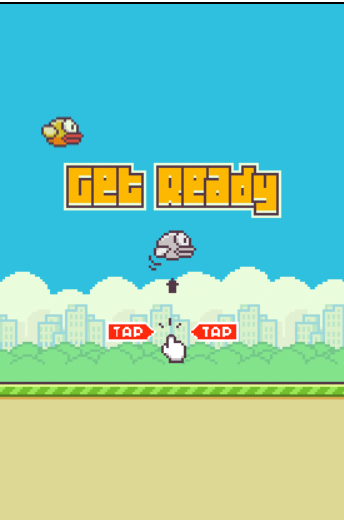
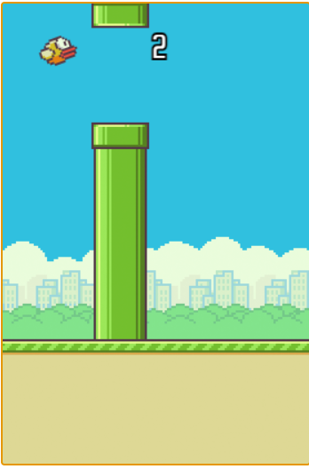
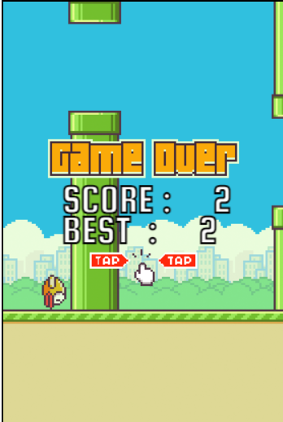

# Flappy Bird 🐦🎮

A simple **Flappy Bird** clone built with **HTML, CSS, and JavaScript**. The game runs in a web browser using the `<canvas>` element.

## 🎮 Demo
[Play it](https://hashsushil.github.io/flappy-bird/)

## 📌 Features
✅ Classic Flappy Bird mechanics  
✅ Responsive canvas (adapts to different screen sizes)  
✅ Simple and clean UI  
✅ Smooth animations  

## 🚀 How to Play
- **Tap (Mobile) / Click (Desktop) / Spacebar** to make the bird flap.  
- Avoid hitting the pipes.  
- Try to get the highest score!  

## Screenshots
### Home

### Gameplay

### Scores

